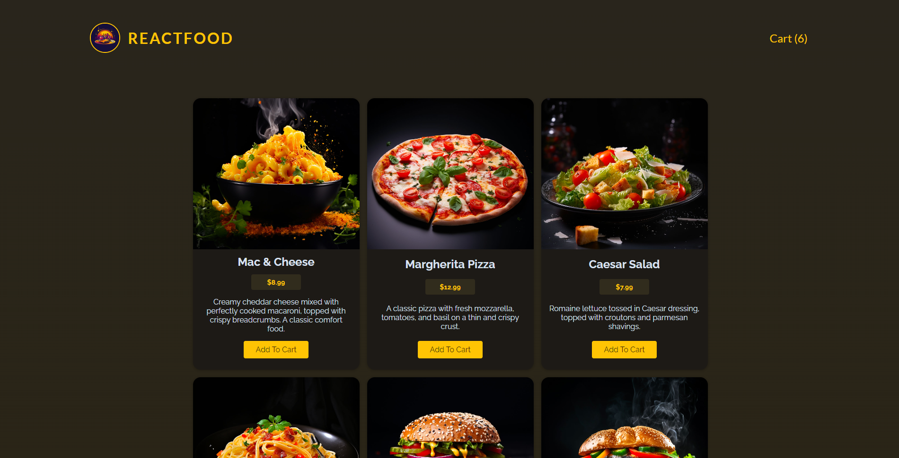
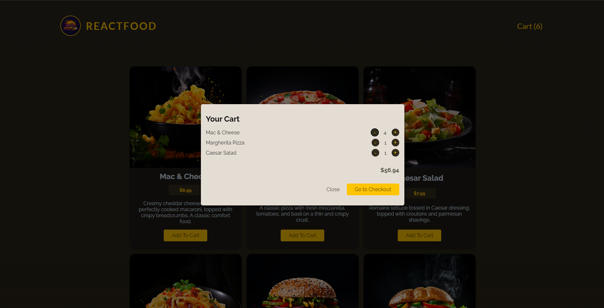
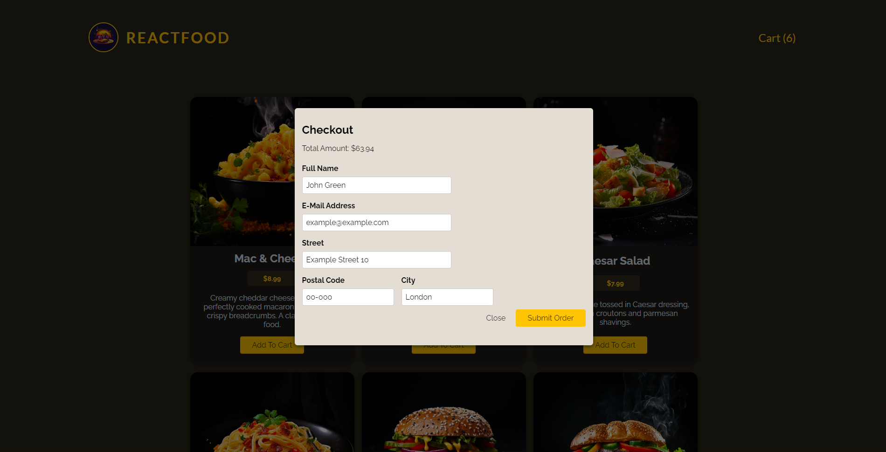
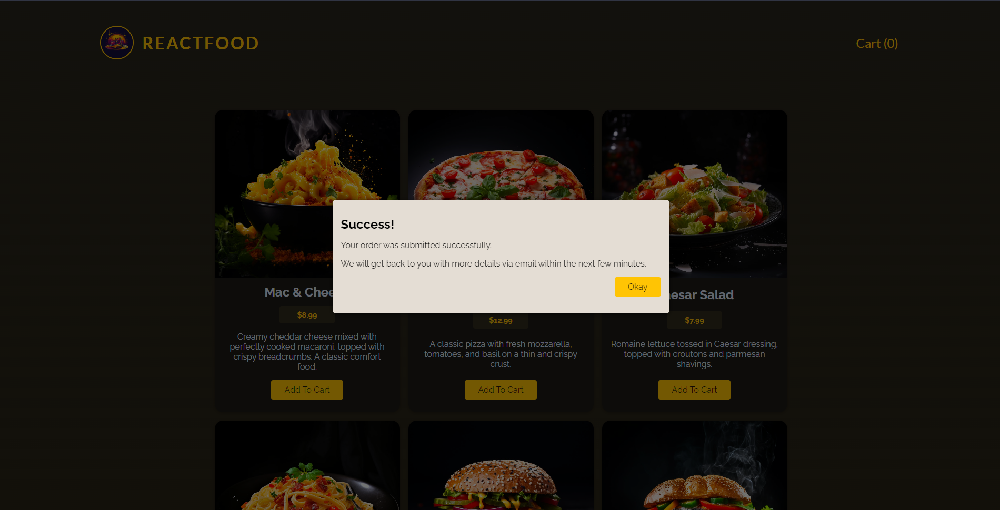

# React Food Order App 

This is project from Maximillian Schwarzmuller's Academind React Course. I took it as a challenge and made it myself from scratch only using some ready CSS and backend that was provided in the course.

## What I learned?

Thanks to this project, I refreshed my knowledge of React hooks such as useState, useEffect, useContext or useRef. During the development of this application, I applied my theoretical knowledge in practice and learned how to combine everything I learned in the course into one whole.

## Screenshots

### Main page

### Cart modal

### User Form modal

### Success information modal

